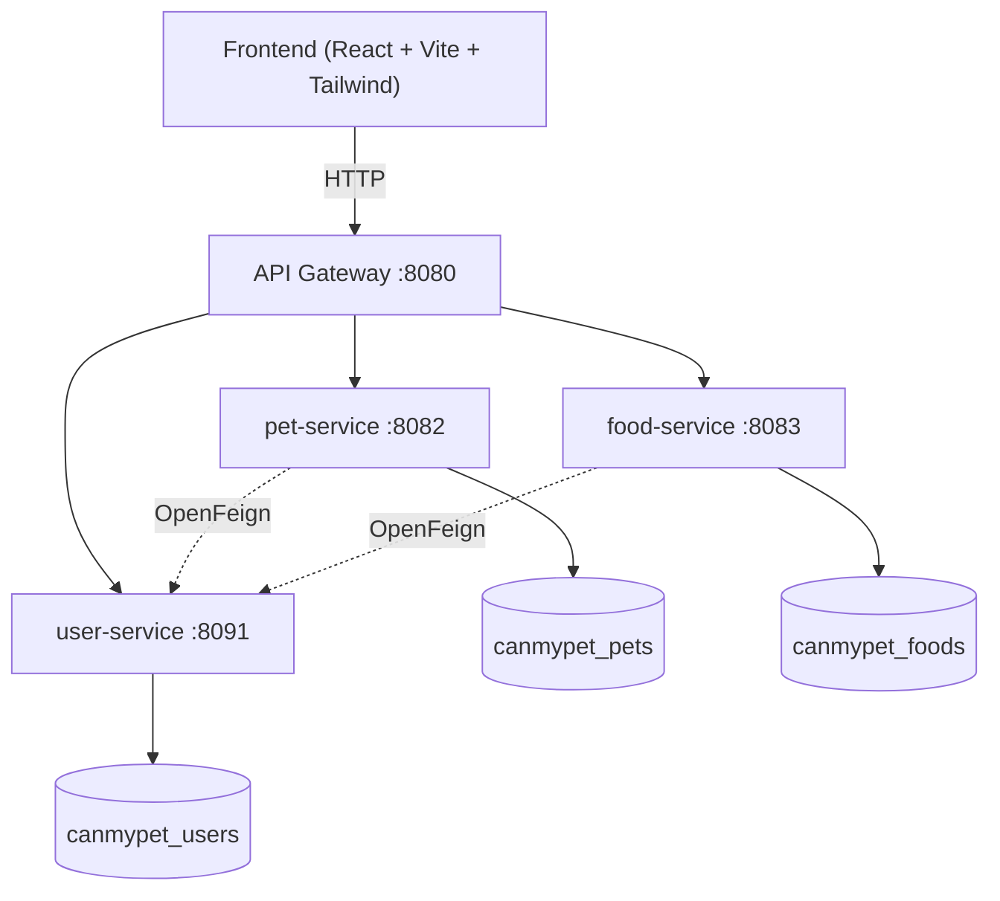

# CanMyPet

Web platform to check food safety risk levels for pets by species and life stage, manage
multiple pet profiles, keep search history, and access emergency guidance.
Includes a veterinarian role for verifying food safety entries and answering FAQs, and an
admin panel for approving veterinarians, maintaining the food catalog and editing emergency guides.

## Tech stack

- **Backend:** Java 19 + Spring Boot 3.3.4 + Spring Security (JWT) + Maven
- **Architecture:** Microservices (4 independent Spring Boot services + API Gateway)
- **Inter-service communication:** REST via OpenFeign
- **Frontend:** React 19 + Vite + Tailwind CSS v4 + React Router
- **Database:** PostgreSQL 16 (database-per-service)
- **Containerization:** Docker & Docker Compose
- **API Documentation:** Swagger / OpenAPI (per service) + Postman collection
- **Testing:** JUnit 5, Mockito, AssertJ, Spring Security Test, Testcontainers, Vitest, React Testing Library
- **CI:** GitHub Actions (backend and frontend workflows)

## Architecture



- The frontend only ever talks to the **API Gateway**, which routes each request to the right service based on an explicit list of paths (see [API Gateway routing](#api-gateway-routing)).
- Services that need data from another service call it directly via **OpenFeign** (dashed lines above), never through the gateway and never by touching another service's database.
- Each service owns its own PostgreSQL database — no cross-service SQL joins, no service discovery tool (small, fixed number of services; Docker Compose's internal DNS is enough).

## Getting started

1. Copy `.env.example` to `.env` and fill in real values (database credentials, JWT secret, etc.).
2. Run `docker compose up --build`.
3. Wait for all 5 containers (`postgres`, `user-service`, `pet-service`, `food-service`, `api-gateway`) to report healthy/running: `docker compose ps`.
4. API Gateway (single entry point for all requests): `http://localhost:8080`
5. Frontend: run `npm install` and `npm run dev` inside `frontend/`, then open `http://localhost:5173`

### API documentation

- **Postman collection:** available at `docs/postman/` — the complete, ready-to-import reference for every endpoint, including an auto-saving JWT token script.
- **Swagger UI** (interactive, live from each running service):
  - user-service: `http://localhost:8091/swagger-ui/index.html`
  - pet-service: `http://localhost:8082/swagger-ui/index.html`
  - food-service: `http://localhost:8083/swagger-ui/index.html`

## Endpoints

### Auth & Users (user-service)

| Method | Path | Auth required | Description |
|---|---|---|---|
| POST | `/api/auth/register` | No | Register a new user (OWNER or VETERINARIAN). ADMIN cannot self-register; the first admin is created from `ADMIN_EMAIL` / `ADMIN_PASSWORD` at startup |
| POST | `/api/auth/login` | No | Log in, returns a JWT |
| GET | `/api/users/me` | Yes | Get the current user's profile |
| PUT | `/api/users/me` | Yes | Update the current user's profile |
| GET | `/api/users?role=VETERINARIAN&verified=false` | ADMIN | List users by role, optionally filtered by `verified` (paginated, oldest first by default) |
| PUT | `/api/users/{id}/verify` | ADMIN | Approve a veterinarian account |
| GET | `/api/users/{id}` | Internal | Service-to-service lookup used by pet-service and food-service. Not routed through the API Gateway |

### Pets & Search History (pet-service)

| Method | Path | Auth required | Description |
|---|---|---|---|
| GET | `/api/pets` | Yes | List the current user's pets |
| POST | `/api/pets` | Yes | Create a pet |
| PUT | `/api/pets/{id}` | Yes (owner) | Update a pet |
| DELETE | `/api/pets/{id}` | Yes (owner) | Delete a pet |
| GET | `/api/search-history/me` | Yes | Get the current user's search history (paginated, newest first) |
| POST | `/api/search-history` | Yes | Record a search |

### Foods & Food Safety (food-service)

| Method | Path | Auth required | Description |
|---|---|---|---|
| GET | `/api/foods?query=` | Yes | List foods (paginated, sorted by name), optionally filtered by name |
| GET | `/api/foods/{id}` | Yes | Get a food by id |
| GET | `/api/foods/search?query=` | Yes | Search foods by name (up to 10 suggestions) |
| GET | `/api/foods/by-ids?ids=1,5,9` | Yes | Get several foods by id (max 100 ids) |
| POST | `/api/foods` | ADMIN | Create a food |
| PUT | `/api/foods/{id}` | ADMIN | Update a food |
| GET | `/api/food-safety?status=PENDING` | VETERINARIAN, ADMIN | Review queue by verification status (paginated, oldest first) |
| GET | `/api/food-safety/{foodId}` | Yes | Get all risk entries for a food, across species |
| GET | `/api/food-safety/{foodId}/{species}` | Yes | Get risk levels for a food/species, optionally filtered by `?lifeStage=` |
| POST | `/api/food-safety` | Verified VETERINARIAN, ADMIN | Create a food safety entry (starts as `PENDING`) |
| PUT | `/api/food-safety/{id}/verify` | Verified VETERINARIAN | Verify a food safety entry |

### FAQ & Emergency Guidance (food-service)

| Method | Path | Auth required | Description |
|---|---|---|---|
| GET | `/api/faq?status=` | Yes | List questions (paginated, newest first), optionally filtered by `PENDING` or `ANSWERED` |
| POST | `/api/faq` | Yes | Ask a question |
| PUT | `/api/faq/{id}/answer` | Verified VETERINARIAN | Answer a question |
| GET | `/api/emergency/{riskLevel}` | Yes | Get emergency guidance for a risk level |
| POST | `/api/emergency` | ADMIN | Create or update an emergency guide |

### Pagination

Endpoints marked *paginated* accept `page` (0-based), `size` (default 20, capped at 100 by the server) and `sort` (for example `sort=createdAt,asc`). They respond with:

```json
{ "content": [], "page": 0, "size": 20, "totalElements": 42, "totalPages": 3 }
```

`GET /api/pets` is intentionally not paginated: it only returns the authenticated user's own pets, and the pet selector needs the full list.

### API Gateway routing

The gateway only forwards the paths the frontend needs, listed explicitly in `backend/api-gateway/src/main/resources/application.yml`. Internal endpoints such as `GET /api/users/{id}` are not exposed, and a new endpoint is not reachable through the gateway until its path is added there.


## Testing

- **Unit tests:** JUnit 5 + Mockito, covering the core business logic of each service.
- **Web layer security tests:** `@WebMvcTest` + Spring Security Test, confirming role checks are enforced before reaching the service layer (for example, an ADMIN cannot verify a food safety entry).
- **Frontend tests:** Vitest + React Testing Library. Run `npm run test:run` inside `frontend/`.
- **Integration tests:** Testcontainers spins up a real PostgreSQL 16 container to test the full registration/login flow end-to-end.
- Run locally per service: `mvn clean test` (inside each `backend/<service>` folder).
- Runs automatically on every push via GitHub Actions (`.github/workflows/backend-ci.yml` and `.github/workflows/frontend-ci.yml`).

## Contributing / Commit conventions

This project follows [Conventional Commits](https://www.conventionalcommits.org/) for commit messages:

```
<type>: <short description>
```

Common types used in this project:
- `feat:` — a new feature
- `fix:` — a bug fix
- `docs:` — documentation-only changes
- `test:` — adding or updating tests
- `refactor:` — code reorganization without changing behavior
- `ci:` — changes to CI/CD configuration
- `chore:` — maintenance tasks (dependencies, config)

The repository follows [Semantic Versioning](https://semver.org/) (`MAJOR.MINOR.PATCH`) with a single version for the whole project: the four `pom.xml` files and `frontend/package.json` always share the same number, which is bumped when a milestone is released.